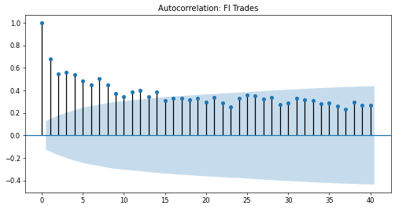
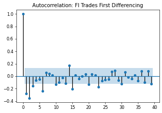
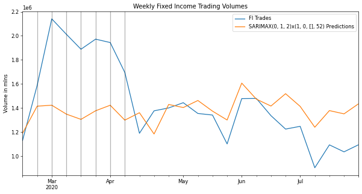
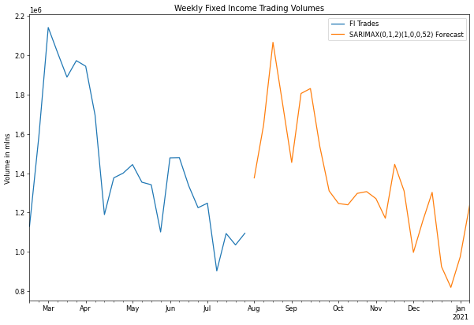

# Fixed Income Trading Volumes
## Analyzing trade volumes and forecasting future volumes with time series analysis.

### Overview
* The purpose of this project was to forecast the time series of customer fixed income volumes. 
* The settlement of these securities generates fees and is therefore correlated to the activity in these respective markets.  
* The ability to forecast these volumes and indirectly the fee revenue generated can provide helpful forecasting insights.

### Code and Resources Used
Python Version: 3.7  
Environment: Google Colab  
Packages: pandas, numpy, statsmodels, sklearn, matplotlib, pmdarima

### Data Cleaning
* Comparing internal trading volumes to that of the Primary Dealer activity as reported by the NY Fed.  That series is weekly and reported on Wednesdays of each week.  All other daily datasets were resampled accordingly.
* A dataframe was built for each product:  a) Internal Trading Volumes, b) MOVE Index(US Treasury volatility index), c) Primary Dealer Volumes

### EDA
Given the potential seasonality of the data sources, I checked if our time series were stationary.  Using the Dickey Fuller test it was proven to show some signs of a trend in the mean. Below are a few highlights:

* To more precisely find the order to run our model, I applied the auto_arima funtion.
* Initially the model didn't track well which failed to capture some exogenous dataset features.  This was corrected for when incorporating the additional time series from the primary dealer activity and the MOVE Index.

### Model Building
* Reviewed the AIC(Akaike's Information Criteria) metric which demonstrated some improvement when incorporating seasonality into the model.
* Applied the SARIMAX model that incorporates seasonality as well as exogenous data.
* First tried incorporating the MOVE Index which displayed a modest improvement in the error metric.
* Second I tested out the SARIMAX model with the Primary Dealer dataset.  

### Model Performance
Applied the comparison metric of the root mean square percentage error (RMSPE):
* SARIMAX with no exogenous regressors:  23%
* SARIMAX with exog=MOVE Index:  16%
* SARIMAX with exog =Primary Dealers: 11%

